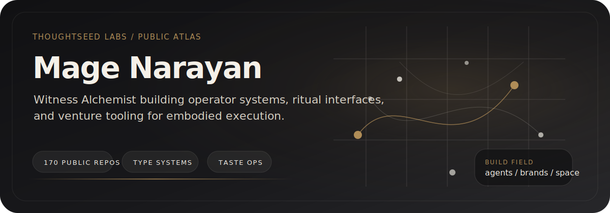

  

## `> whoami`

I build systems that treat awareness as architecture. Not metaphor — infrastructure. Every tool I ship maps inner process to outer structure: breath to build pipeline, body to interface protocol, consciousness to computational engine. This is the work at [Thoughtseed Labs](https://github.com/thoughtseed-labs) — grounded in practice, verified in code, silent where it doesn't need to speak.

## Selected Works

<table>
<tr>
<td width="50%" valign="top">

### [`brandmint-oracle-aleph`](https://github.com/Sheshiyer/brandmint-oracle-aleph)

End-to-end brand identity orchestration. 44 skills, deterministic pipeline from voice to visual to deployment. The system that builds brands the way bodies build tissue — layered, adaptive, alive.

</td>
<td width="50%" valign="top">

### [`Selemene-engine`](https://github.com/Sheshiyer/Selemene-engine)

Reflection-first consciousness engine with 16 symbolic mirrors. Consciousness mapped to computation — not simulated, structured.

</td>
</tr>
<tr>
<td width="50%" valign="top">

### [`velvetclaw`](https://github.com/Sheshiyer/velvetclaw)

Declarative multi-agent org for OpenClaw. Self-assembling agent architecture — agents that organize themselves the way organisms differentiate.

</td>
<td width="50%" valign="top">

### [`vscode-noesis-bioluminescent-theme`](https://github.com/Sheshiyer/vscode-noesis-bioluminescent-theme)

The brand rendered as development environment. Void Black canvas, sacred geometry color logic, bioluminescent accents. You code inside the aesthetic.

</td>
</tr>
<tr>
<td width="50%" valign="top">

### [`reddit-flux`](https://github.com/Sheshiyer/reddit-flux) · [`glam-cli`](https://github.com/Sheshiyer/glam-cli)

Developer CLI tools. Reddit reads and Instagram automation — deterministic, scriptable, no GUI required.

</td>
<td width="50%" valign="top">

### [`readme-skill`](https://github.com/Sheshiyer/readme-skill)

Auto-generate modern READMEs by scanning your repo. The tool that writes the page you're reading.

</td>
</tr>
</table>

<b>More Projects</b>

 

| Project | Language | Description |
|---------|----------|-------------|
| [`10865xseed`](https://github.com/Sheshiyer/10865xseed) | Python | prana.init |
| [`14113-X-vault`](https://github.com/Sheshiyer/14113-X-vault) | JavaScript | ENNEA + PARA + MUSES |
| [`tirak-website-v1`](https://github.com/Sheshiyer/tirak-website-v1) | TypeScript | Tirak web platform |
| [`SomaticCanticles-aleph0.1`](https://github.com/Sheshiyer/SomaticCanticles-aleph0.1) | TypeScript | Somatic Canticles engine |
| [`kristudios-wiki`](https://github.com/Sheshiyer/kristudios-wiki) | Astro | Knowledge wiki |
| [`spatial-anubis-noesis`](https://github.com/Sheshiyer/spatial-anubis-noesis) | TypeScript | Spatial computing prototype |
| [`framer-plugin-mcp`](https://github.com/Sheshiyer/framer-plugin-mcp) | JavaScript | MCP server for Framer |
| [`homebrew-brandmint`](https://github.com/Sheshiyer/homebrew-brandmint) | Ruby | Homebrew tap for Brandmint |
| [`brandmint-showcase`](https://github.com/Sheshiyer/brandmint-showcase) | HTML | Brandmint demo site |

## Stack

## GitHub Stats

  
  &nbsp;&nbsp;
  

## Signal

  <i>"Structure reveals what noise obscures."</i>

  

