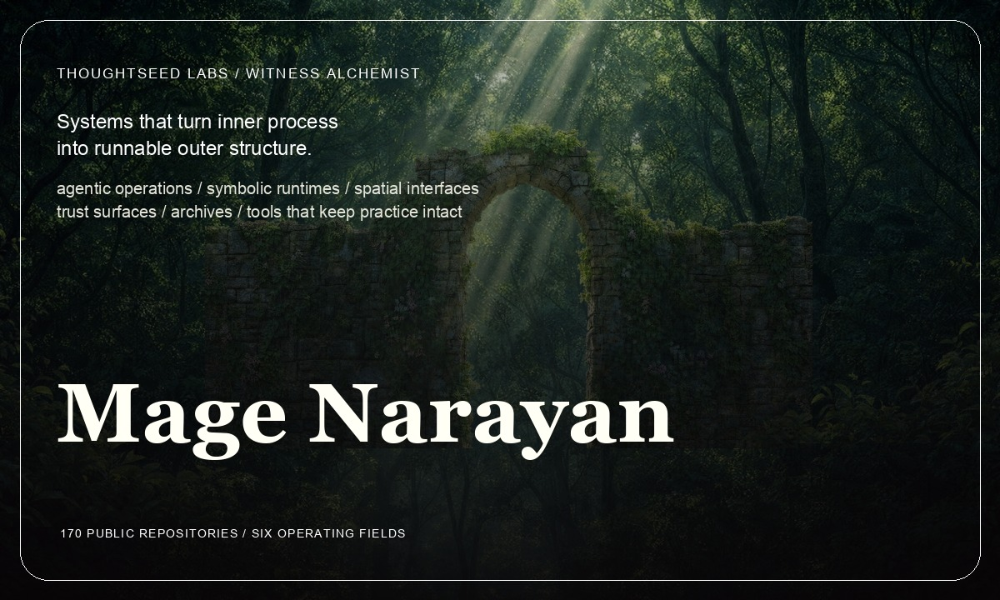
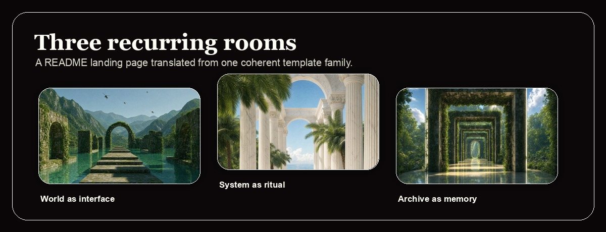

  <a href="#world">World</a>
  &nbsp;/&nbsp;
  <a href="#rooms">Rooms</a>
  &nbsp;/&nbsp;
  <a href="#public-work-index">Index</a>
  &nbsp;/&nbsp;
  <a href="#build-principles">Principles</a>
  &nbsp;/&nbsp;
  <a href="#public-signal">Connect</a>

# Mage Narayan

**Witness Alchemist at Thoughtseed Labs.** Systems that turn inner process into runnable outer structure.

Public work spans **170 non-fork repositories**, led by TypeScript, Python, JavaScript, Astro, Shell, and Rust. The surface moves through six rooms: agentic operations, symbolic runtimes, spatial interfaces, trust surfaces, narrative archives, and tools that keep practice intact.

<table>
<tr>
<td width="58%" valign="top">

### World

Agentic products, brand orchestration, local operator runtimes, spatial viewers, and reflection-first computing.

</td>
<td width="42%" valign="top">

### Materials

TypeScript, React, Astro, Python, Rust, Cloudflare, Electron, Tauri, Raycast, shell automation.

</td>
</tr>
</table>

## World

Most software ships the outer surface. The harder work is the substrate underneath: intention becoming procedure, procedure becoming interface, interface becoming repeatable work.

That substrate appears here as venture operators, brand foundries, local agent runtimes, spatial real-estate systems, narrative engines, healing-marketplace tools, and reflection-first computing experiments.

## Rooms

| Room | What it holds | Public evidence |
| --- | --- | --- |
| World as interface | Spatial systems, property viewers, portals, panorama tools. | [`vantyx`](https://github.com/Sheshiyer/vantyx), [`marina1-k`](https://github.com/Sheshiyer/marina1-k), [`newsense-spatial`](https://github.com/Sheshiyer/newsense-spatial) |
| System as ritual | Operators, skill clusters, generated brand systems, local runtimes. | [`cambium`](https://github.com/Sheshiyer/cambium), [`brandmint-oracle-aleph`](https://github.com/Sheshiyer/brandmint-oracle-aleph), [`temperance_engine`](https://github.com/Sheshiyer/temperance_engine) |
| Archive as memory | Narrative engines, research surfaces, symbolic vaults. | [`synchronocities-blog`](https://github.com/Sheshiyer/synchronocities-blog), [`Somatic-Canticles`](https://github.com/Sheshiyer/Somatic-Canticles), [`wtfmedia`](https://github.com/Sheshiyer/wtfmedia) |

<!-- public-work-index:start -->
## Public work index

| Field | Public repos | Recent anchors | Pattern |
| --- | ---: | --- | --- |
| Venture operations | 12 | [`cambium`](https://github.com/Sheshiyer/cambium), [`temperance_engine`](https://github.com/Sheshiyer/temperance_engine), [`snow-gloves-os`](https://github.com/Sheshiyer/snow-gloves-os), [`brandmint-oracle-aleph`](https://github.com/Sheshiyer/brandmint-oracle-aleph) | Taste, planning, execution, and review stay in the same loop. |
| Reflection runtimes | 15 | [`noesismirror-web`](https://github.com/Sheshiyer/noesismirror-web), [`witness-agents`](https://github.com/Sheshiyer/witness-agents), [`tpothp`](https://github.com/Sheshiyer/tpothp), [`Selemene-engine`](https://github.com/Sheshiyer/Selemene-engine) | Symbolic work is kept runnable, inspectable, and grounded in code. |
| Spatial systems | 11 | [`marina1-k`](https://github.com/Sheshiyer/marina1-k), [`vantyx`](https://github.com/Sheshiyer/vantyx), [`newsense-spatial`](https://github.com/Sheshiyer/newsense-spatial), [`dashboard-0.1-coproperty`](https://github.com/Sheshiyer/dashboard-0.1-coproperty) | Place is treated as interface: mapped, navigable, and operational. |
| Trust surfaces | 13 | [`fitcheck-landing`](https://github.com/Sheshiyer/fitcheck-landing), [`klear-karma-website-v2`](https://github.com/Sheshiyer/klear-karma-website-v2), [`kkv2-astro-wiki`](https://github.com/Sheshiyer/kkv2-astro-wiki), [`tirakplus`](https://github.com/Sheshiyer/tirakplus) | Trust surfaces carry consent, verification, and cultural context. |
| Narrative archives | 21 | [`synchronocities-blog`](https://github.com/Sheshiyer/synchronocities-blog), [`somatic-canticles-bm-wiki`](https://github.com/Sheshiyer/somatic-canticles-bm-wiki), [`wtfmedia`](https://github.com/Sheshiyer/wtfmedia), [`somatic-canticles-v3-book-trilogy`](https://github.com/Sheshiyer/somatic-canticles-v3-book-trilogy) | Archives hold story, research, media, and ritual without flattening them. |
| Toolmaking | 98 | [`plexus-ts`](https://github.com/Sheshiyer/plexus-ts), [`framer-plugin-mcp`](https://github.com/Sheshiyer/framer-plugin-mcp), [`skill-clusters`](https://github.com/Sheshiyer/skill-clusters), [`professional-headshot-suite`](https://github.com/Sheshiyer/professional-headshot-suite) | Expert workflows become portable without shaving off the practice. |

## Recent public movement

| Repository | Field | Language | Focus |
| --- | --- | --- | --- |
| [`noesismirror-web`](https://github.com/Sheshiyer/noesismirror-web) | Reflection runtimes | TypeScript | Immersive 3D memory palace viewer for witness premium packs |
| [`plexus-ts`](https://github.com/Sheshiyer/plexus-ts) | Toolmaking | TypeScript | Plexus - Thoughtseed member runtime (Listener/Runner/State + bridge client). Electron app per... |
| [`cambium`](https://github.com/Sheshiyer/cambium) | Venture operations | TypeScript | Cambium - the autonomous, on-brand venture operator. Free build, paid taste. Umbrella for the brandmint... |
| [`synchronocities-blog`](https://github.com/Sheshiyer/synchronocities-blog) | Narrative archives | TypeScript | A 55-day mythic journey through Thailand told as a depth-scrolling tarot gallery. 20 unique card... |
| [`fitcheck-landing`](https://github.com/Sheshiyer/fitcheck-landing) | Trust surfaces | TypeScript | Fitcheck - AI virtual try-on launch landing for Shopify fashion brands. Zero-dep static site... |
| [`klear-karma-website-v2`](https://github.com/Sheshiyer/klear-karma-website-v2) | Trust surfaces | HTML | Klear Karma v2 landing site - design-first 12-section premium static site with GPT-Image-2 generated... |
| [`witness-agents`](https://github.com/Sheshiyer/witness-agents) | Reflection runtimes | TypeScript | Embodied meaning-authoring dyad - Aletheios & Pichet as inference layer for Selemene Engine and... |
| [`marina1-k`](https://github.com/Sheshiyer/marina1-k) | Spatial systems | HTML | Marina One, Bengaluru - immersive 360 panorama viewer (5 floors x morning/evening/night). Static build... |

<b>Public language profile</b>

 

| Language | Public non-fork repositories |
| --- | ---: |
| TypeScript | 72 |
| JavaScript | 22 |
| Python | 21 |
| Unspecified | 18 |
| HTML | 13 |
| Astro | 9 |
| Shell | 7 |
| CSS | 3 |
| Rust | 1 |
| MDX | 1 |
| Ruby | 1 |
| Mermaid | 1 |

<!-- public-work-index:end -->

## Build principles

| Principle | How it shows up |
| --- | --- |
| Taste is operational | Brand, interface, copy, and workflow are treated as one system. |
| Reflection before prediction | Tools should expose assumptions, traces, and choice points before they automate. |
| Local-first where possible | Operator tools should keep secrets, context, and agency close to the user. |
| Interfaces carry ritual | Good UI changes the rhythm of work, not only the speed of clicking. |

## Stack and surfaces

  
  
  
  
  
  
  
  

## Public signal

  
  
  
  

<i>"Structure reveals what noise obscures."</i>
