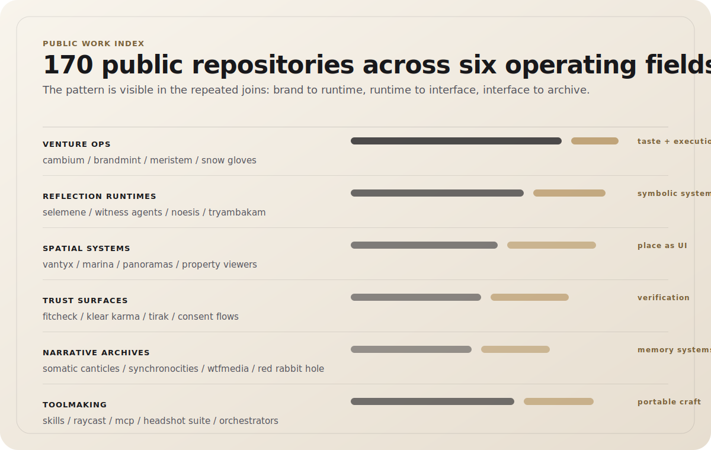

  <a href="#through-line">Through-line</a>
  &nbsp;/&nbsp;
  <a href="#public-work-index">Public work index</a>
  &nbsp;/&nbsp;
  <a href="#recent-public-movement">Recent movement</a>
  &nbsp;/&nbsp;
  <a href="#build-principles">Build principles</a>
  &nbsp;/&nbsp;
  <a href="#public-signal">Signal</a>

# Mage Narayan

**Witness Alchemist at Thoughtseed Labs.** Systems for turning inner process into runnable outer structure.

Public work spans **170 non-fork repositories**, led by TypeScript, Python, JavaScript, Astro, Shell, and Rust. The work moves between agentic operations, symbolic runtimes, spatial interfaces, trust surfaces, narrative archives, and small tools that make expert practice portable.

<table>
<tr>
<td width="58%" valign="top">

### Practice

Agentic product systems, brand orchestration, local operator runtimes, spatial viewers, and reflection-first computing.

</td>
<td width="42%" valign="top">

### Materials

TypeScript, React, Astro, Python, Rust, Cloudflare, Electron, Tauri, Raycast, shell automation.

</td>
</tr>
</table>

## Through-line

Most software ships the outer surface. The harder work is the substrate underneath: intention becoming procedure, procedure becoming interface, interface becoming repeatable work.

That substrate appears here as venture operators, brand foundries, local agent runtimes, spatial real-estate systems, narrative engines, healing-marketplace tools, and reflection-first computing experiments.

<!-- public-work-index:start -->
## Public work index

| Field | Public repos | Recent anchors | Pattern |
| --- | ---: | --- | --- |
| Venture operations | 12 | [`cambium`](https://github.com/Sheshiyer/cambium), [`temperance_engine`](https://github.com/Sheshiyer/temperance_engine), [`snow-gloves-os`](https://github.com/Sheshiyer/snow-gloves-os), [`brandmint-oracle-aleph`](https://github.com/Sheshiyer/brandmint-oracle-aleph) | Taste, planning, execution, and review stay in the same loop. |
| Reflection runtimes | 14 | [`tpothp`](https://github.com/Sheshiyer/tpothp), [`Selemene-engine`](https://github.com/Sheshiyer/Selemene-engine), [`witness-agents`](https://github.com/Sheshiyer/witness-agents), [`witness-agents-113`](https://github.com/Sheshiyer/witness-agents-113) | Symbolic work is kept runnable, inspectable, and grounded in code. |
| Spatial systems | 11 | [`vantyx`](https://github.com/Sheshiyer/vantyx), [`marina1-k`](https://github.com/Sheshiyer/marina1-k), [`newsense-spatial`](https://github.com/Sheshiyer/newsense-spatial), [`dashboard-0.1-coproperty`](https://github.com/Sheshiyer/dashboard-0.1-coproperty) | Place is treated as interface: mapped, navigable, and operational. |
| Trust surfaces | 13 | [`fitcheck-landing`](https://github.com/Sheshiyer/fitcheck-landing), [`klear-karma-website-v2`](https://github.com/Sheshiyer/klear-karma-website-v2), [`kkv2-astro-wiki`](https://github.com/Sheshiyer/kkv2-astro-wiki), [`tirakplus`](https://github.com/Sheshiyer/tirakplus) | Trust surfaces carry consent, verification, and cultural context. |
| Narrative archives | 21 | [`synchronocities-blog`](https://github.com/Sheshiyer/synchronocities-blog), [`somatic-canticles-bm-wiki`](https://github.com/Sheshiyer/somatic-canticles-bm-wiki), [`wtfmedia`](https://github.com/Sheshiyer/wtfmedia), [`somatic-canticles-v3-book-trilogy`](https://github.com/Sheshiyer/somatic-canticles-v3-book-trilogy) | Archives hold story, research, media, and ritual without flattening them. |
| Toolmaking | 99 | [`motionsites-skills`](https://github.com/Sheshiyer/motionsites-skills), [`plexus-ts`](https://github.com/Sheshiyer/plexus-ts), [`framer-plugin-mcp`](https://github.com/Sheshiyer/framer-plugin-mcp), [`skill-clusters`](https://github.com/Sheshiyer/skill-clusters) | Expert workflows become portable without shaving off the practice. |

## Recent public movement

| Repository | Field | Language | Focus |
| --- | --- | --- | --- |
| [`cambium`](https://github.com/Sheshiyer/cambium) | Venture operations | TypeScript | Cambium - the autonomous, on-brand venture operator. Free build, paid taste. Umbrella for the brandmint... |
| [`motionsites-skills`](https://github.com/Sheshiyer/motionsites-skills) | Toolmaking | HTML | Catalogued MotionSites.ai prompt-template library (265 templates) + a rate-limited, resumable... |
| [`fitcheck-landing`](https://github.com/Sheshiyer/fitcheck-landing) | Trust surfaces | TypeScript | Fitcheck - AI virtual try-on launch landing for Shopify fashion brands. Zero-dep static site... |
| [`synchronocities-blog`](https://github.com/Sheshiyer/synchronocities-blog) | Narrative archives | TypeScript | A 55-day mythic journey through Thailand told as a depth-scrolling tarot gallery. 20 unique card... |
| [`plexus-ts`](https://github.com/Sheshiyer/plexus-ts) | Toolmaking | TypeScript | Plexus - Thoughtseed member runtime (Listener/Runner/State + bridge client). Electron app per... |
| [`framer-plugin-mcp`](https://github.com/Sheshiyer/framer-plugin-mcp) | Toolmaking | JavaScript | A Model Context Protocol (MCP) server for creating and managing Framer plugins with web3 capabilities |
| [`temperance_engine`](https://github.com/Sheshiyer/temperance_engine) | Venture operations | Shell | Public installer for a local PAI operator runtime with skill-cluster routing, optional peon-ping voice... |
| [`snow-gloves-os`](https://github.com/Sheshiyer/snow-gloves-os) | Venture operations | Shell | Snow Gloves OS - hand-in-glove business operations orchestration with connectors, interpretation, and... |

<b>Public language profile</b>

 

| Language | Public non-fork repositories |
| --- | ---: |
| TypeScript | 71 |
| JavaScript | 22 |
| Python | 20 |
| Unspecified | 19 |
| HTML | 13 |
| Astro | 9 |
| Shell | 7 |
| CSS | 4 |
| Rust | 1 |
| MDX | 1 |
| Ruby | 1 |
| Mermaid | 1 |

<!-- public-work-index:end -->

## Build principles

| Principle | How it shows up |
| --- | --- |
| Taste is operational | Brand, interface, copy, and workflow are treated as one system. |
| Reflection before prediction | Tools should expose assumptions, traces, and choice points before they automate. |
| Local-first where possible | Operator tools should keep secrets, context, and agency close to the user. |
| Interfaces carry ritual | Good UI changes the rhythm of work, not only the speed of clicking. |

## Stack and surfaces

  
  
  
  
  
  
  
  

## Public signal

  
  
  
  

<i>"Structure reveals what noise obscures."</i>
